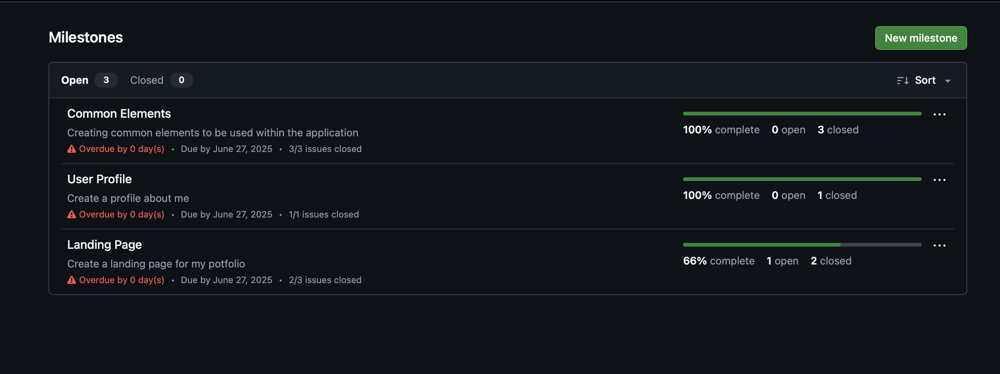
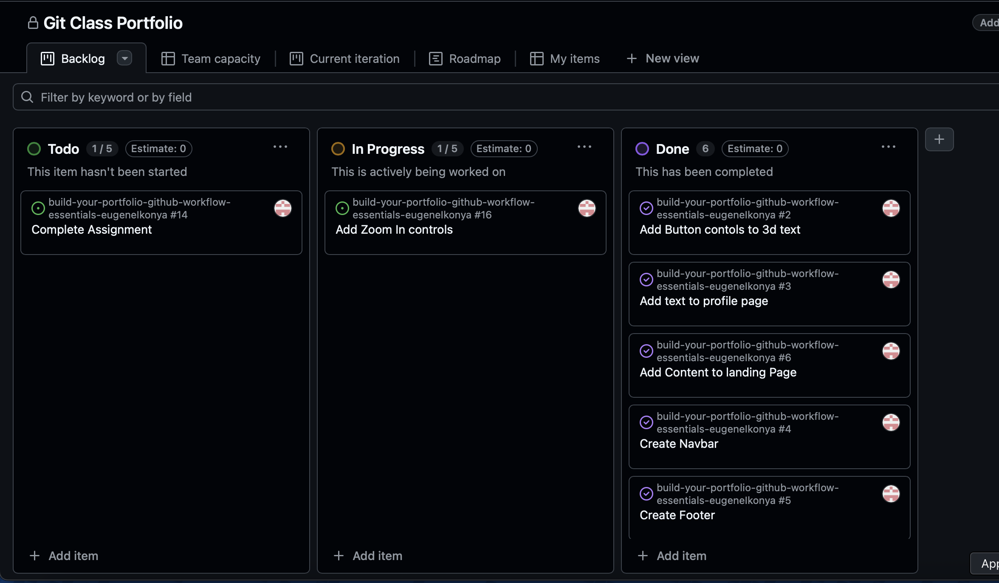
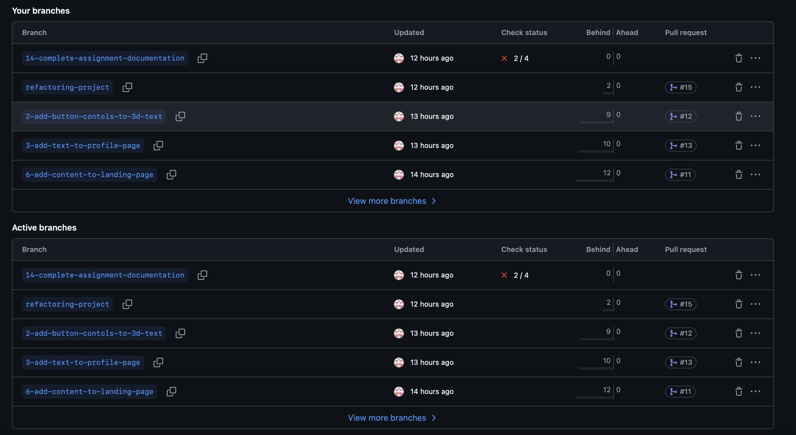
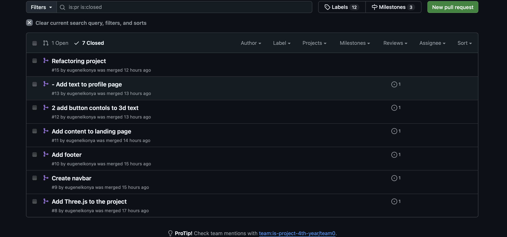

# Personal Portfolio Documentation

## 1. Student Details

- **Full Name**: Eugene Ikonya
- **Admission Number**: 112448
- **GitHub Username**: eugeneIkonya
- **Email**: eugeneikonya@gmail.com

## 2. Deployed Portfolio Link

- **GitHub Pages URL**: https://is-project-4th-year.github.io/build-your-portfolio-github-workflow-essentials-eugeneIkonya/

## 3. Learnings from the Git Crash Program

**What I Thought I'd Learn vs What I Actually Learned**

1. `Concept: Git Branching`

`Expectation 👀`: Just a way to make copies of code.

`Reality 😅`: A powerful feature for isolating features and experiments without affecting the main code. Learned how to create, switch, and merge branches effectively.

`Impact 💡`: Helped me develop new features like the 3D text animation and color controls independently without breaking the working version.

2. `Concept: Pull Requests`

`Expectation 👀`: Just clicking a button to merge code.

`Reality 😅`: A collaborative code review process that helps catch issues early and maintain code quality.

`Impact 💡`: Used PRs to properly integrate new features like zoom controls and UI improvements with proper documentation.

3. `Concept: Project Boards`

`Expectation 👀`: Another complex project management tool.

`Reality 😅`: An intuitive way to visualize and track tasks, making project progress clear and manageable.

`Impact 💡`: Helped organize portfolio development into clear tasks like "Add 3D Text", "Implement Controls", etc.

4. `Concept: Issue Management`

`Expectation 👀`: Just a bug tracker.

`Reality 😅`: A comprehensive system for planning features, tracking bugs, and documenting decisions.

`Impact 💡`: Used issues to plan and track each portfolio feature, linking them to PRs and milestones.

## 4. Screenshots of Key GitHub Features

### A. Milestones and Issues

This screenshot shows how I organized my portfolio development into milestones and tracked progress through issues.

### B. Project Board

My project board showing the kanban-style organization of tasks from planning to completion.

### C. Branching

Shows my branch strategy, including feature branches for different portfolio components.

### D. Pull Requests

Example of a pull request showing the implementation of new features with proper review process.

### E. Merge Conflict Resolution
[Add a screenshot of a resolved merge conflict when you encounter one]
